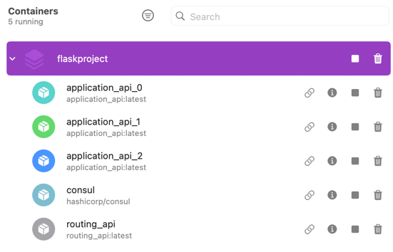
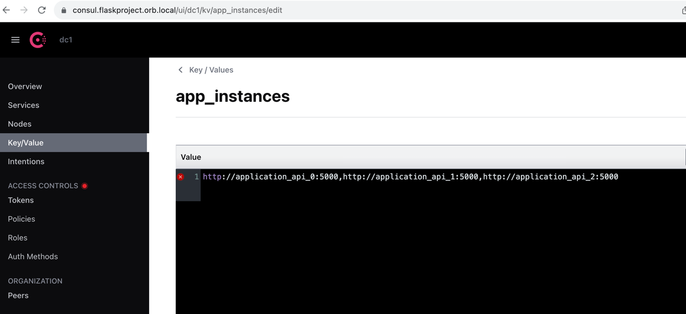

### How to run this repo
```shell
sh start.sh
```
This shell will do the followings
1. running test for routing_api
2. build application_api
3. build routing_api
4. start all the services (consul / application_api / routing_api)
5. inject the app instances into consul by `curl`

Once the script finished, you can see the 5 services are all up



---
### Structure of this repo
1. Files
   2. **config.env**: environment variables
   3. **docker-compose.yml**: define all the services
   4. **start**.sh: start this repo
2. Directory
   3. **application_api**: a backend service which response what you send to it in JSON
   4. **routing_api**: the service which has the capability to distribute the requests to upstream services by round-robin
3. Services
   - Consul: Serve as a service-discovery service, and it can inject the service instances into routing_api
   - 
   - application_api 
     - URL
       - application_api_0 => http://localhost:10001/
       - application_api_1 => http://localhost:10002/
       - application_api_2 => http://localhost:10003/
     - API
       - send request:
         - purpose: just send any json payload and get the response with the same payload 
         - endpoint = "/"
         - payload: any json
         - method: POST
       - update status: 
         - purpose: change the status of this backend service, _0 = health, 1 = slow down, 2 = unavailable
         - endpoint = "/update_status"
         - method: POST
   - routing_api 
     - URL: http://localhost:20001
     - API
       - send request: 
       - purpose: just send any json payload and get the response with the same payload 
       - endpoint = "/", payload: any json
       - response
```json
{
    "1_status": "success",
    "2_data_from_upstream": {
        "game": "Mobile Legends",
        "gamerID": "sid",
        "points": 20
    },
    "3_upstream": {
        "upstream_index": 2,
        "upstream_service": "http://application_api_2:5000"
    },
    "4_response_time_ms_statistic": {
        "current": "3,6,6",
        "previous": "3,6,3"
    },
    "5_resting_number": {
        "current": "0,0,0",
        "previous": "0,0,0"
    },
    "6_explanation": "service 2 is chosen because its resting number is zero",
    "7_rules": "Rules: 1. rest number == 0 | 2.smallest resp time if resp time < timeout",
    "8_metadata": {
        "slow_down_threshold_ms": 100,
        "timeout_threshold_ms": 5000
    }
}
```
---
### Round-Robin
I use 3 kind of information below to implement round-robin.
All the RR related logic are under `class RoundRobin` inside `routing_api/util.py`. 
For the core RR logic, please refer to the function `get_instance_index`, and I put more explanation there.

1. resp_time_stat: list[int] = []
   - record the latest response time (ms) for each service. For ex: [1,10,11] means the response time are 1,10,11 ms individually of service 0,1,2
2. resting_number: list[int] = []
   - record the resting number for each service. if the resting number > 0, means that a service should be skipped after ${resting number} API calls. for ex: [1,2] means servie 0 has to be skipped 1 time.
3. cur_idx = 0
   - means what is the current upstream service we should use.

---
### Questions
1. How would my round-robin API handle it if one of the application APIs goes down? 
   - If there is an application going down, in my code, I'll give this application a resting number (defined as TIMEOUT_REST_NUMBER in config.env)
   - Before the resting number is decreased to **zero**, this service should be skipped.
2. How would my round-robin API handle it if one of the application APIs starts to go
slowly?
   - If there is an application slow down, in my code, I'll give this application a resting number (defined as SLOW_DOWN_REST_NUMBER in config.env)
   - Before the resting number is decreased to **zero**, this service should be skipped.
3. How would I test this application?
   - Assumption: we have 3 instances 0, 1, 2
   - Unit test: routing_api/tests/test_routing_api.py
     - Positive test case: test_positive_no_delay_and_no_timeout
     - Negative test cases:
       - test_negative_one_delay (slow down)
       - test_negative_one_timeout (go down)
       - test_negative_one_timeout_and_one_delay (slow down and go down)
       - test_all_timeout (all go down)
   - Manually test: By [POSTMAN collection], and please refer to the mail
     - Positive test case: test_positive_no_delay_and_no_timeout
     - Negative test cases:
       - test_negative_1_delay (slow down)
       - test_negative_2_delay (slow down)
       - test_negative_3_delay (slow down)
       - test_negative_1_timeout (go down)
       - test_negative_2_timeout (go down)
       - test_negative_3_timeout (go down)
       - test_negative_1_timeout_and_1_delay (slow down and go down)
       - test_negative_2_timeout_and_1_delay (slow down and go down)
       - test_negative_1_timeout_and_2_delay (slow down and go down)
       - test_all_timeout (all go down)
       - test_all_delay (all slow down)

